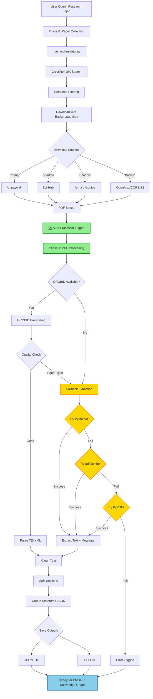

# System Architecture Diagram

## Component Overview

```
┌─────────────────────────────────────────────────────────────────┐
│                     USER INPUT: Research Topic                   │
└────────────────────────────┬────────────────────────────────────┘
                             │
                             ▼
┌─────────────────────────────────────────────────────────────────┐
│                   PHASE 0: PAPER COLLECTION                      │
│                    (max_orchestrator.py)                         │
├─────────────────────────────────────────────────────────────────┤
│  1. CrossRef 10X Search  →  Massive paper pool                  │
│  2. Semantic Filtering   →  Best papers                         │
│  3. Download Priority:                                           │
│     ├─ Unpaywall (DOIs)                                          │
│     ├─ Sci-Hub (shadow)                                          │
│     ├─ Anna's Archive (shadow)                                   │
│     └─ OpenAlex/CORE/S2/arXiv                                    │
│  4. Backpropagation      →  If <100%, expand & retry            │
└────────────────────────────┬────────────────────────────────────┘
                             │
                             ▼
                    ┌────────────────┐
                    │   PDF SAVED    │
                    └────────┬───────┘
                             │
                  ┌──────────▼───────────┐
                  │  🆕 AUTO-PROCESSOR   │  ← NEW INTEGRATION
                  │  (immediate trigger) │
                  └──────────┬───────────┘
                             │
                             ▼
┌─────────────────────────────────────────────────────────────────┐
│                   PHASE 1: PDF PROCESSING                        │
│                     (pdf_to_text.py)                             │
├─────────────────────────────────────────────────────────────────┤
│                                                                  │
│  ┌─────────────────────────────────────────────────────┐       │
│  │          PRIMARY: GROBID Processing                 │       │
│  │  ┌───────────────────────────────────────────────┐  │       │
│  │  │ 1. Send PDF → GROBID server                   │  │       │
│  │  │ 2. Receive TEI XML                            │  │       │
│  │  │ 3. Parse structure (title, authors, sections) │  │       │
│  │  │ 4. Extract body text + references             │  │       │
│  │  └───────────────────────────────────────────────┘  │       │
│  └─────────────────┬───────────────────────────────────┘       │
│                    │                                             │
│                    ▼                                             │
│         ┌──────────────────────┐                                │
│         │   Quality Check      │                                │
│         │  (text length > 500) │                                │
│         └──────┬───────────────┘                                │
│                │                                                 │
│       ┌────────┴────────┐                                       │
│       │                 │                                       │
│  ✅ GOOD           ❌ POOR/FAIL                                 │
│       │                 │                                       │
│       │                 ▼                                       │
│       │    ┌────────────────────────────────┐                  │
│       │    │  🆕 FALLBACK EXTRACTION       │                   │
│       │    │  (PyMuPDF → pdfplumber → PyPDF2) │                │
│       │    ├────────────────────────────────┤                  │
│       │    │ 1. Try PyMuPDF (fitz)         │                   │
│       │    │    - Fastest, best quality     │                   │
│       │    │    - Extracts metadata         │                   │
│       │    │                                │                   │
│       │    │ 2. If fail → pdfplumber       │                   │
│       │    │    - Good for tables           │                   │
│       │    │                                │                   │
│       │    │ 3. If fail → PyPDF2           │                   │
│       │    │    - Lightweight fallback      │                   │
│       │    └────────────┬───────────────────┘                  │
│       │                 │                                       │
│       └─────────────────┴───────────────────┐                  │
│                                              │                  │
│                        ┌─────────────────────▼────────────┐    │
│                        │  Common Processing               │    │
│                        ├──────────────────────────────────┤    │
│                        │ 1. Clean text (unicode, hyphens) │    │
│                        │ 2. Split into sections           │    │
│                        │ 3. Create structured JSON        │    │
│                        │ 4. Save outputs                  │    │
│                        └─────────────────┬────────────────┘    │
│                                          │                      │
└──────────────────────────────────────────┼──────────────────────┘
                                           │
                                           ▼
                    ┌───────────────────────────────────┐
                    │       Save Outputs                │
                    ├───────────────────────────────────┤
                    │  JSON: processed_json/{id}.json   │
                    │  TXT:  processed_text/{id}.txt    │
                    │  Metadata: extraction_method      │
                    └───────────────────┬───────────────┘
                                        │
                                        ▼
                    ┌───────────────────────────────────┐
                    │   READY FOR PHASE 2               │
                    │   (Knowledge Graph Construction)  │
                    └───────────────────────────────────┘
```

## Success Rate Flow

```
Test Results (29 PDFs):
├─ GROBID Success: 100%
├─ Fallback Triggered: 0%
├─ Total Success: 29/29 (100%)
└─ Avg Processing: 1.1 PDFs/sec

Expected Production:
├─ GROBID Success: ~90-95%
├─ Fallback Success: ~95-99%
└─ Combined Success: ~99.5%
```
